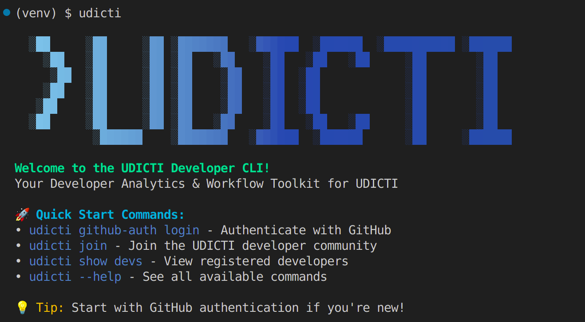

# UDICTI CLI 
### Your Community & Github Workflow Toolkit for UDSM Developers

<a>
 </a>

**UDICTI CLI** is a simple, command-line tool built by and for developers at UDSM. It centralizes community connection, smart Git workflows, and developer analytics—all designed around real club needs and integrated with GitHub.

This CLI is mainly for learning and can help you get started using and building CLI tools


## ✨ Key Features

*   **Seamless GitHub Integration**: Securely authenticate and connect to your GitHub account.
*   **Community at Your Fingertips**: Join the UDICTI community, view onboarded developers, and stay updated.
*   **Developer Dashboards**: Get a personalized analysis of your GitHub profile and activity.
*   **Streamlined Workflows**: Effortlessly clone repositories, find contribution opportunities, and create standardized pull requests.
*   **Logbook Automation (Upcoming)**: Fill your practical training reports directly from your Git history.

---

## 📦 Installation

###  Recommended: Using pipx (All Platforms)

**pipx** installs CLI tools in isolated environments while making them globally available.

#### Linux (Ubuntu/Debian)
```bash
# Install pipx
sudo apt install pipx

# Install UDICTI CLI
pipx install udicti-cli

# Use anywhere
udicti welcome
```

#### macOS
```bash
# Install pipx via Homebrew
brew install pipx

# Or via pip
python3 -m pip install --user pipx
python3 -m pipx ensurepath

# Install UDICTI CLI
pipx install udicti-cli

# Use anywhere
udicti welcome
```

#### Windows
```cmd
# Install pipx via pip
python -m pip install --user pipx
python -m pipx ensurepath

# Install UDICTI CLI
pipx install udicti-cli

# Use anywhere
udicti welcome
```

---

### 🐍 Alternative: Using Virtual Environment

#### Linux/macOS
```bash
# Create virtual environment
python3 -m venv udicti-env

# Activate virtual environment
source udicti-env/bin/activate

# Install UDICTI CLI
pip install udicti-cli

# Use the CLI
udicti welcome

# To use later, reactivate:
source udicti-env/bin/activate
```
 ---

For the latest development version, you can install it directly from the repository:

```bash
# Clone the repository
git clone https://github.com/Sirily23/udicti-cli.git

# Navigate to the project directory
cd udicti-cli

# Create and activate a virtual environment
python -m venv venv
source venv/bin/activate

# Install the tool in "editable" mode
pip install -e .
```

---

## 🚀 Quick Start

Run the `welcome` command to get an overview of the tool:
```bash
udicti
```

---

## ⚙️ Commands

Here are some of the core commands to get you started:

| Command                 | Description                                                                                               |
| ----------------------- | --------------------------------------------------------------------------------------------------------- |
| `udicti welcome`          | Displays a friendly welcome message and an overview of the CLI.                                           |
| `udicti github-auth`    | Manages secure authentication with your GitHub account (`--login`, `--logout`, `--status`).                 |
| `udicti join`             | Join the UDICTI developer community right from your terminal.                                             |
| `udicti show dev`         | Shows the list of developers who are currently onboarded.                                                 |
| `udicti dashboard me`     | Displays an analysis of your GitHub profile and recent activity.                                          |
| `udicti gh clone`         | Simplifies cloning UDICTI organization repositories.                                                      |
| `udicti gh issue-find`  | Finds open issues in UDICTI repos, with filters for labels like "good first issue" or "help wanted."      |
| `udicti gh pr-create`     | Guides you through creating pull requests with UDICTI-standardized templates.                             |
| `udicti logbook --fill`   | **(Upcoming)** Fills your practical training report using your Git logs and work history.                 |


---

## 🤝 Contributing

We welcome contributions! This is a club project, and we believe it can only get better with your help. Whether it's adding new features, improving a command, or enhancing the documentation, your contribution is valuable.

Using this projects for learning and geting familiar with use if cli tools.

Please see the `CONTRIBUTING.md` file for more details.

## 📝 License

This project is licensed under the MIT License.

## 🙏 Credits

A huge thank you to the entire UDICTI UDSM community for the inspiration and collaboration.

*Created with passion by the UDICTI Dev Team.*
